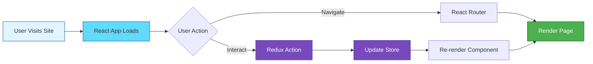
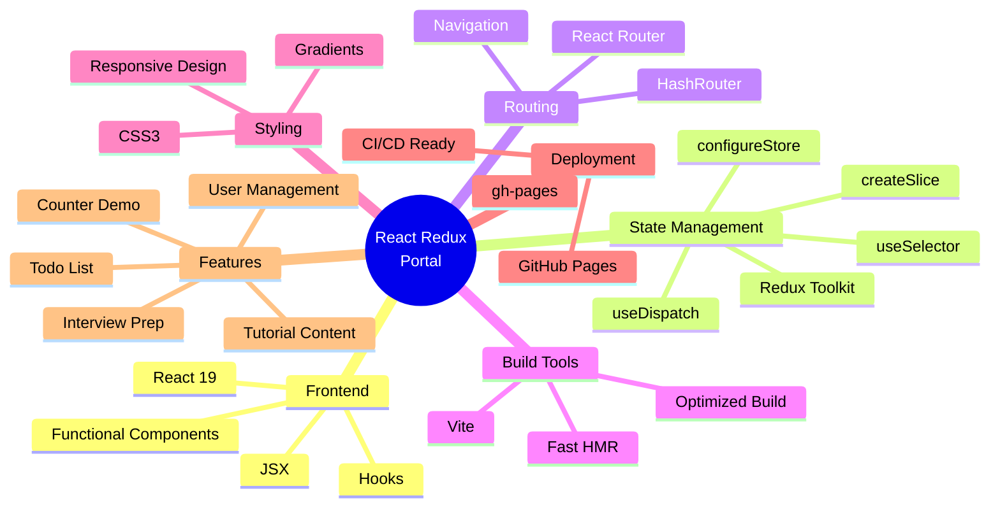

# React & Redux Learning Portal - Architecture Diagram

## Copy this to https://mermaid.live to generate image

```mermaid
graph TB
    subgraph "Technology Stack"
        React["React 19<br/>UI Library"]
        Redux["Redux Toolkit<br/>State Management"]
        Router["React Router<br/>Navigation"]
        Vite["Vite<br/>Build Tool"]
    end

    subgraph "Application Architecture"
        App["App Component<br/>HashRouter"]
        Navbar["Navbar<br/>Navigation"]
        
        subgraph "Pages"
            Home["Home Page<br/>Tutorials & Guide"]
            ReactNotes["React Notes<br/>Learning Content"]
            ReduxNotes["Redux Notes<br/>Learning Content"]
        end
        
        subgraph "Interactive Demos"
            Counter["Counter Demo<br/>Basic Redux"]
            Todo["Todo List Demo<br/>CRUD Operations"]
            Users["User Management<br/>Advanced Redux"]
        end
        
        Footer["Footer<br/>Links & Info"]
    end

    subgraph "Redux Store"
        Store["Redux Store<br/>configureStore"]
        
        subgraph "Slices"
            CounterSlice["counterSlice<br/>increment/decrement"]
            TodoSlice["todosSlice<br/>add/toggle/delete"]
            UserSlice["usersSlice<br/>CRUD operations"]
        end
    end

    subgraph "Data Flow"
        UI["User Interface<br/>React Components"]
        Dispatch["dispatch(action)"]
        Reducer["Reducers<br/>Update State"]
        NewState["New State"]
        Rerender["Re-render UI"]
    end

    subgraph "Deployment"
        GitHub["GitHub Repository<br/>Source Code"]
        Build["npm run build<br/>Production Bundle"]
        GHPages["GitHub Pages<br/>gh-pages branch"]
        Live["Live Site<br/>sumitcodesai.github.io"]
    end

    React --> App
    Redux --> Store
    Router --> App
    Vite --> Build
    
    App --> Navbar
    App --> Home
    App --> ReactNotes
    App --> ReduxNotes
    App --> Counter
    App --> Todo
    App --> Users
    App --> Footer
    
    Store --> CounterSlice
    Store --> TodoSlice
    Store --> UserSlice
    
    Counter -.connects.-> CounterSlice
    Todo -.connects.-> TodoSlice
    Users -.connects.-> UserSlice
    
    UI --> Dispatch
    Dispatch --> Reducer
    Reducer --> NewState
    NewState --> Rerender
    Rerender --> UI
    
    GitHub --> Build
    Build --> GHPages
    GHPages --> Live

    style React fill:#61dafb,stroke:#333,stroke-width:2px,color:#000
    style Redux fill:#764abc,stroke:#333,stroke-width:2px,color:#fff
    style Router fill:#ca4245,stroke:#333,stroke-width:2px,color:#fff
    style Vite fill:#646cff,stroke:#333,stroke-width:2px,color:#fff
    style Store fill:#764abc,stroke:#333,stroke-width:2px,color:#fff
    style Live fill:#28a745,stroke:#333,stroke-width:2px,color:#fff
```

## Alternative: Simple Flow Diagram

```mermaid
flowchart LR
    A[User Visits Site] --> B[React App Loads]
    B --> C{User Action}
    C -->|Navigate| D[React Router]
    C -->|Interact| E[Redux Action]
    D --> F[Render Page]
    E --> G[Update Store]
    G --> H[Re-render Component]
    H --> F
    
    style A fill:#e1f5ff,stroke:#01579b
    style B fill:#61dafb,stroke:#01579b
    style E fill:#764abc,stroke:#4527a0,color:#fff
    style G fill:#764abc,stroke:#4527a0,color:#fff
    style F fill:#4caf50,stroke:#1b5e20,color:#fff
```

## Technology Stack Visual

```mermaid
mindmap
  root((React Redux<br/>Portal))
    Frontend
      React 19
      JSX
      Hooks
      Functional Components
    State Management
      Redux Toolkit
      createSlice
      configureStore
      useSelector
      useDispatch
    Routing
      React Router
      HashRouter
      Navigation
    Build Tools
      Vite
      Fast HMR
      Optimized Build
    Styling
      CSS3
      Gradients
      Responsive Design
    Deployment
      GitHub Pages
      gh-pages
      CI/CD Ready
    Features
      Counter Demo
      Todo List
      User Management
      Tutorial Content
      Interview Prep
```
